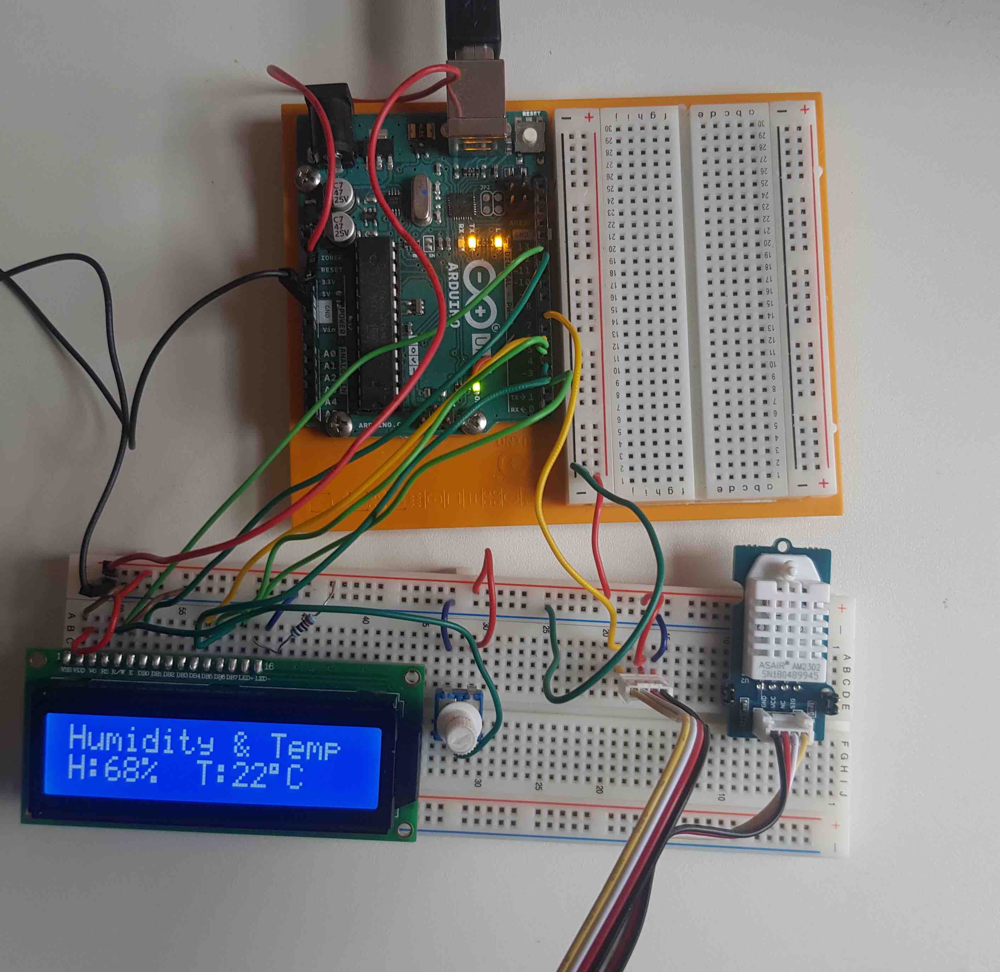

# Room Humidity and Temperature Display (Simple)

Required Items:
----------------------
Arduino: Uno
Sensor: ASAIR AM2302 (Humidity and Temperatrue Sensor)
LCD: TC1602A 
Potention meter: 10K
Ressitor: 220-ohm
